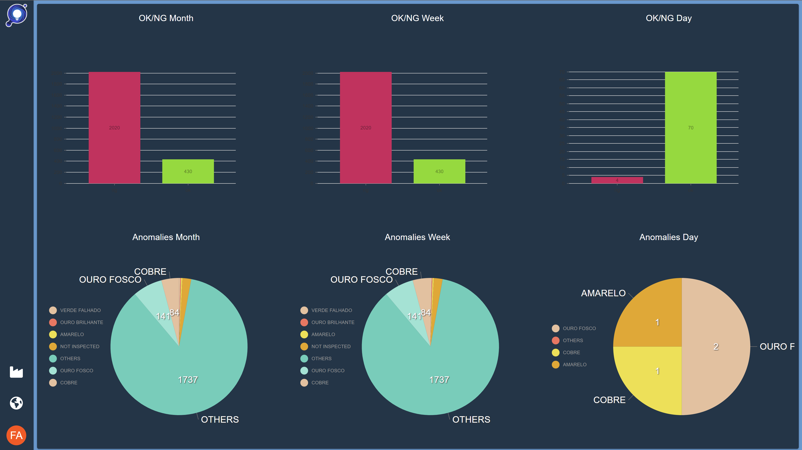
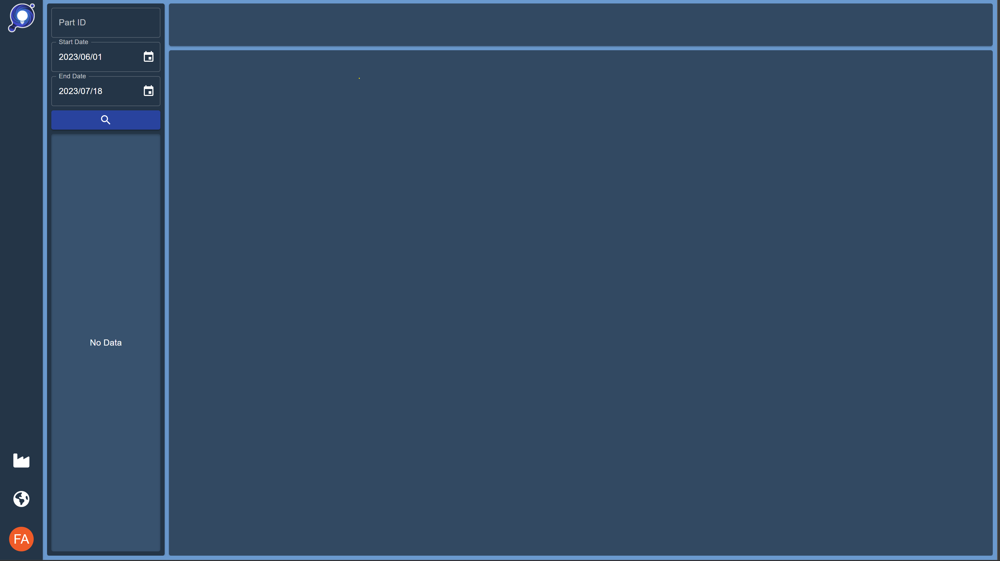
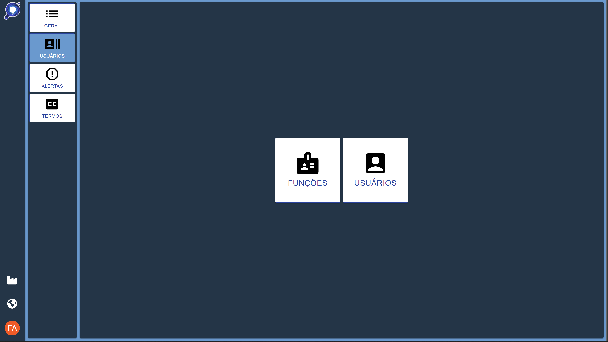

# EYEFLOW-FE-FRAMEWORK

## PAGES

### Login

### Home

### HMI

#### Batch

#### Serial

### Dashboard

#### Query

#### History

### History

### Management

| Tab  | Image  |
|---|---|
| General  |   |  
| Users  |   |  
| Alerts  |   |  
| From To  |   |  
| Wording  |   |  

### Tools

| Tool  | Image  |
|---|---|
| Images Capturer  |   |  
| Box Editor  |   |  
| Dot Editor  |   |  
| Query  |   |  
| Images Analyser  |   |  
| Object Builder  |   |  