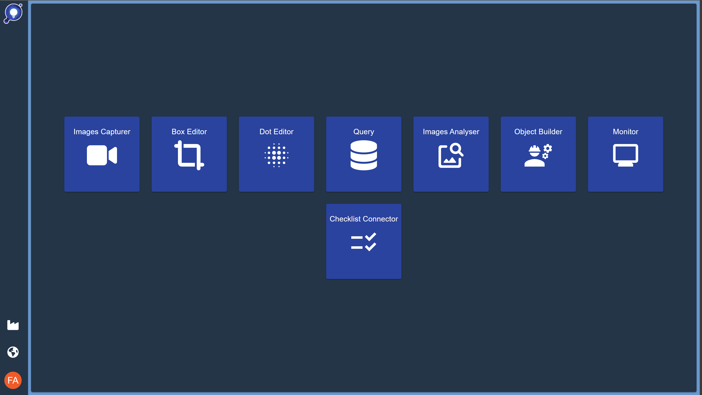
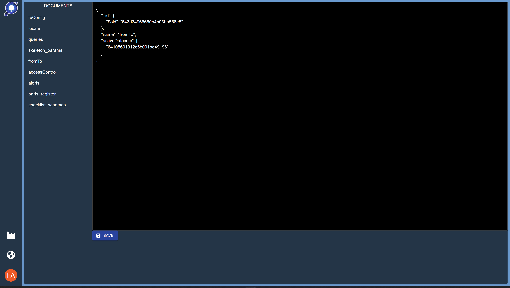

# EYEFLOW-FE-FRAMEWORK

## PAGES

### Login

### Home

### HMI

#### Batch

#### Serial

### Dashboard

#### Report

### History

### Management

| Tab     | Screen                                                                                         |
| ------- | ---------------------------------------------------------------------------------------------- |
| General |  |
| Users   |        |
| Alerts  |     |
| Wording |  |

### Tools

| Tool                | Screen                                                                                                     |
| ------------------- | ---------------------------------------------------------------------------------------------------------- | --- |
| Images Capturer     |              |     |
| Query               |                                           |
| Images Analyser     |              |
| Monitor             |                                     |
| CheckList Connector |  |
| App Parameters      |                 |
